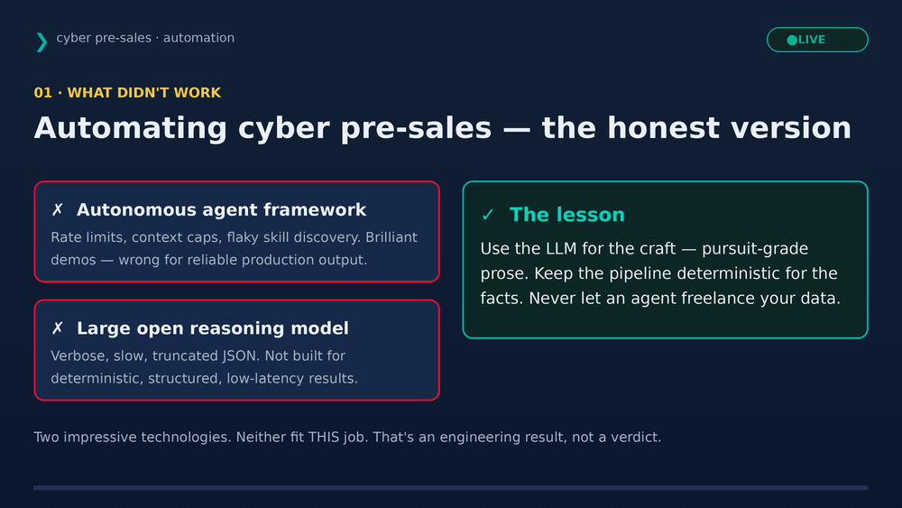

# electronic — Colt cyber pre-sales automation (single source of truth)

Two zero-trust Telegram bots that automate cyber pre-sales, deployed to a DigitalOcean droplet,
using multi-cloud services and reusing an existing Grafana/Loki stack. CI/CD via GitHub Actions.



*(Interactive version: open `colt_platform_architecture.html`. Full-motion: `cyber_presales_architecture.mp4`.)*

## What's here
| Path | Purpose |
|------|---------|
| `assess-bot/` | **colttechbot** — `/assess` → Shodan recon → DeepSeek enrichment → 4 VIP decks |
| `cassandra-bot/` | **cassandra** — `/research` (live OSINT), MEDDPICC, outreach, help desk |
| `colt_auth.py` | shared zero-trust auth: colt.net email + password + **email OTP 2FA (Gmail API)** |
| `hermes-skills/shodan-assessment/` | the deterministic engine (recon + deck generators + bible) |
| `obs/` | promtail/Grafana config — ships logs into the **existing** Loki (reuse mode) |
| `docker-compose.reuse.yml` | isolated `colt-stack` next to existing services; ships to existing Loki |
| `deploy.py` · `enable_gmail_api.py` · `import_dashboard.py` · `fix_smtp.py` | ops scripts |
| `.github/workflows/` | CI (lint + secret scan) and CD (deploy to the droplet) |

## Multi-cloud roles
- **GitHub** — source of truth + CI/CD orchestration.
- **DigitalOcean** — runtime (droplet, isolated `colt-stack`) + serverless AI inference (DeepSeek).
- **Google Cloud** — Gmail API delivers the 2FA one-time codes over HTTPS (droplet blocks SMTP).

## CI/CD
- **CI** (`ci.yml`, every push/PR): gitleaks secret scan, Python compile + ruff, `node --check` the
  deck builders, compose validation.
- **CD** (`deploy.yml`, push to `main`): runs the tested `deploy.py --reuse` over SSH. The checkout
  carries **no secrets** (gitignored), so the droplet's runtime `.env` is preserved.

### GitHub secrets to set (Settings → Secrets and variables → Actions)
| Secret | Value |
|--------|-------|
| `DROPLET_HOST` | droplet IP |
| `DROPLET_USER` | `root` |
| `DROPLET_SSH_KEY` | a **passphrase-less** deploy key's private half (public half in the droplet's `~/.ssh/authorized_keys`) |

Runtime app secrets (bot tokens, DO/Shodan keys, `COLT_BOT_PASSWORD`, `GMAIL_SA_B64`) live **only**
in the droplet's `.env` files — not in GitHub. See `*/.env.example` for the shape.

## Local setup
```bash
cp assess-bot/.env.example assess-bot/.env        # fill in
cp cassandra-bot/.env.example cassandra-bot/.env  # fill in
python enable_gmail_api.py service-account.json   # sets GMAIL_SA_B64 + deploys
python deploy.py --reuse                          # ship to the droplet, reuse existing Loki
```

## Security posture (secure-by-design)
Zero-trust 2FA (mailbox possession) · secrets in env only · allowlisted egress · fetched content
treated as data (prompt-injection defense) · full audit trail in Grafana · no firewall changes on
the shared droplet · gitleaks in CI. **Next:** image scanning (Trivy), a secrets manager, SSO/access
proxy in front of Grafana, and GHCR registry images (build in CI, pull on droplet).
